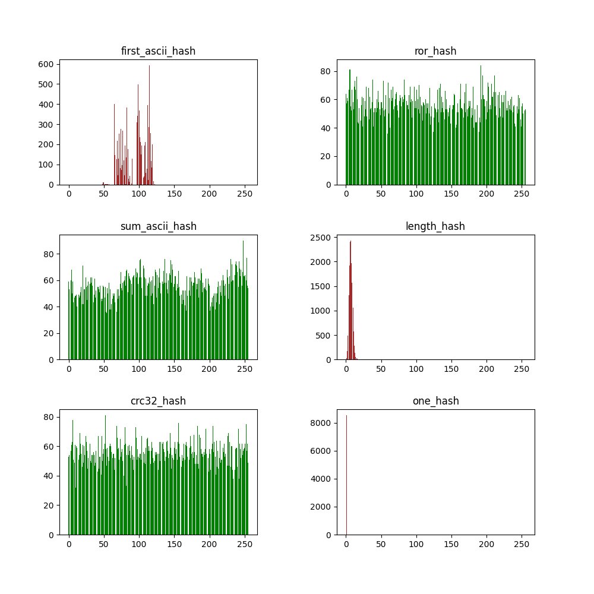

# Hash table


## Table of Contents
1. [Overview](#overview)
2. [Hash comparation](#hash-comparation)
3. [AVX 256 optimizations](#avx-256-optimizations)


## Overview
[Hash table] (also called hash map) is a data structure that implements 
an associative array abstract data type, a structure that can map keys to values. 

<pre>
    ┌────────────┐
    │ Hash table │ 
    ├────────────┤ 
    ├────────────┤  ┌─────────┐  ┌─────────┐      ┌─────────┐
    │ slot 1     ├─>┤ entry 0 ├─>┤ entry 1 ├─...──┤ entry n ├─...
    ├────────────┤  └─────────┘  └─────────┘      └─────────┘
    ├────────────┤  ┌─────────┐  ┌─────────┐  ┌─────────┐
    │ slot 2     ├─>┤ entry 0 ├─>┤ entry 1 ├─>┤ entry 2 ├─...
    ├────────────┤  └─────────┘  └─────────┘  └─────────┘
    │ ...        │ 
    ├────────────┤
    │ slot 255   ├─...
    └────────────┘
</pre>

A **chained hash table** fundamentally consists of an array of linked lists. 
Each list forms a **slot** in which we place all elements hashing to a specific 
position in the array (see figure above).


## Hash comparation
Hash collision is when two pieces of data in a hash table share the same hash value. 
The hash value in this case is derived from a hash function.

<pre>
╔══════════════════╦════════════════════════════════════════════════╗
║ Hash function    ║ Description                                    ║
╚══════════════════╩════════════════════════════════════════════════╝
┌──────────────────┬────────────────────────────────────────────────┐
│ one_hash         │ h(x) = 1                                       │
├──────────────────┼────────────────────────────────────────────────┤
│ first_ascii_hash │ h(x) = x[0]                                    │
├──────────────────┼────────────────────────────────────────────────┤
│ sum_ascii_hash   │ h(x) = x[0] + x[1] + ... + x[len(x)]           │
├──────────────────┼────────────────────────────────────────────────┤
│ ror_hash         │ for i in len(x): h(x) = x[i] xor (h(x) ror 1)  │
├──────────────────┼────────────────────────────────────────────────┤
│ length_hash      │ h(x) = len(x)                                  │
├──────────────────┼────────────────────────────────────────────────┤
│ wsum_ascii_hash  │ h(x) = 1*x[0] + 2*x[1] + ...                   │
├──────────────────┼────────────────────────────────────────────────┤
│ crc32_hash       │ ...                                            │
└──────────────────┴────────────────────────────────────────────────┘
</pre>

Collisions test is described on the figure below:

<pre>
                                           
  ╔════════╗     ╔═════════════════════╗     ╔════════════════╗
  ║ 824528 ║     ║ Load to hash table  ║     ║ Get collisions ║
  ║ words  ║ >>> ║ and calculate words ║ >>> ║ number         ║
  ║ array  ║     ║ duplicates          ║     ║                ║
  ╚════════╝     ╚═════════════════════╝     ╚════════════════╝

</pre>                                      

After analyzing the figures below, we can say that 
hashes **sum_ascii_hash**, **crc32_hash** and **ror_hash** can 
be used as 'good' hash functions.




## AVX 256 optimizations
<pre>
'Premature optimization is the root of all evil'
				  Donald Knuth
</pre>

Almost impossible to defeat compiler when optimizing C code. 
Also it is stupid idea to compare -O2 optimized code with 
a strange -O'default' solutions. And every problem we are having 
is because of playing by the **compiler rules**.
However, there are ways to **defeat** C compiler.

The performance test is super simple. We'll feed the [Bible] 
text right into our hash table 100 times. [perf] linux utility is used to analyze performance.


### Hash table keys format
Now we are playing by our rules. That is why we will choose 32-byte 
buffer to hold the hash table key. 
But to be honest we will tell the compiler about the keys size.

<pre>
  Hash table key format:

  ┌─┬─┬─┬─┬─┬─┬─┬...─┬─┬─┬─┐
  │ │ │ │ │ │ │ │    │ │ │ │
  └─┴─┴─┴─┴─┴─┴─┴...─┴─┴─┴─┘   
  └────────────────────────┘   
           32 bytes            
                               
</pre>

### General performance

For the comparation we will choose -O2 optimized program
described below.

<pre>
    (Before optimization)

    25 522 189 344      cycles:u                  #    4,342 GHz            
    48 879 342 457      instructions:u            #    1,92  insn per cycle 
     9 299 653 700      branches:u                #    1,582 G/sec          
       243 804 891      branch-misses:u           #    2,62% of all branches

       5,893119184 seconds time elapsed
</pre>

Let's find the heaviest functions being called:

<pre>
  43,15%  perf     perf                  [.] crc32_hash     
  31,92%  perf     libc.so.6             [.] __strncmp_avx2 
  16,93%  perf     perf                  [.] htab_list_find  
   4,67%  perf     perf                  [.] htab_find       
   1,72%  perf     perf                  [.] strncmp@plt
</pre>

The heaviest ones are *crc32_hash*, *__strncmp_avx2* and *htab_list_find*. 
The code is listed below:

```c

/* crc32_hash */
hash_t crc32_hash(hkey *key) 
{
        unsigned int byte = 0, mask = 0;
        unsigned int crc = 0xFFFFFFFF;
        
	/*  2,88 │20:   mov    %eax,%ecx       
	   16,82 │      and    $0x1,%eax       
	   26,77 │      neg    %eax            
	    2,72 │      shr    %ecx            
	   13,35 │      and    $0xedb88320,%eax
	   26,41 │      xor    %ecx,%eax */      

        for (int i = 0; (*key)[i] != 0; i++) {
                byte = (*key)[i];
                crc = crc ^ byte;
                
                for (int j = 7; j >= 0; j--) {
                        mask = -(crc & 1);
                        crc = (crc >> 1) ^ (0xEDB88320 & mask);
                }
        }

        return (hash_t)(~crc);
}

```

```c
int compare_keys(hkey *k1, hkey *k2)
{
        /* __strncmp_avx2 */
	/* Here compiler chooses avx2 strncmp version */
	return strncmp(*k1, *k2, 32);
}
```

```c
/* htab_list_find */
ptrdiff_t htab_list_find(list *const lst, hkey *key)
{        
	/* 0,02 │4d:   mov  $0x20,%edx      
	        │      mov  %r13,%rsi  	     
	   9,69 │      mov  %rbx,%rdi  	     
	   0,53 │    → call strncmp@plt	     
	        │      test %eax,%eax  	     
	   8,08 │    ↑ jne  38         	     
	  25,14 │61:   add  $0x8,%rsp  	     
	        │      mov  %r12,%rax  	     
	   8,61 │      pop  %rbx  */   	

        ptrdiff_t cur = lst->head;
        while (cur && compare_keys(&lst->nodes[cur].data.key, key))
                cur = lst->nodes[cur].next;    
                
        return cur;
}
```
### Dealing with crc32_hash
If you want to make something great - make it by yourself.
It means if compiler "can't understand" that we need crc32 
hash, let's write it by hands.

```nasm

crc32_sse:
        mov eax, 0x04c11db7
        lea rsi, [rdi + 32]
.hash:
        crc32 eax, dword [rdi]
        add rdi, 0x4
        cmp rdi, rsi
        jne .hash
        ret
```

After [perf] analysis we get:

<pre>
       │   crc32_sse.hash():                  
 91,21 │0:   crc32l (%rdi),%eax               
  0,62 │     add    $0x4,%rdi                 
       │     cmp    %rsi,%rdi                 
  7,25 │   ↑ jne    0                         
  0,92 │   ← ret
</pre>


More than 90% of function is occupied by crc32 command.
I think we did our best...

### Fast list search
The idea is to use YMM registers as key value type.

```c
#include <immintrin.h>
typedef __m256i hkey;
```

Then inline compare_keys. There are two ways of doing that. 

<pre>
         How to inline compare_keys()?
                      │
       ┌──────────────┴─────────────┐
 Inline asm                      Intrinsics

I hate it.                       Wonderful assembly 
It makes both programmer's   	 alternative.
and compiler's lives miserable

</pre>

Two ways are coded below:

```c
/* Intrinsics version */
ptrdiff_t htab_list_find(list *const lst, hkey *key)
{
...
        /* 10,67 │40:│  mov        0x40(%rcx),%rdx      
            0,87 │   │  test       %rdx,%rdx           
                 │   │↓ je         90                  
            0,42 │49:│  lea        (%rdx,%rdx,2),%rdx  
            3,10 │   │  shl        $0x5,%rdx           
            1,74 │   │  lea        (%rdi,%rdx,1),%rcx  
 here ---> 51,53 │   │  vpcmpeqq   (%rcx),%ymm1,%ymm0  
            0,02 │   │  vpmovmskb  %ymm0,%esi          
            0,65 │   │  cmp        $0xffffffff,%esi    
            2,86 │   │↑ jne        40                  
                 │   │  test       %r13,%r13           
            9,59 │   │↓ je         76 */                 
	
	int find = _mm256_movemask_epi8(
	        _mm256_cmpeq_epi64(
	                _mm256_load_si256(&lst->nodes[cur].data.key), 
	                _mm256_load_si256(key)
	        )
```
```c
/* Inline assembly verison */
ptrdiff_t htab_list_find(list *const lst, hkey *key)
{
...
       	/*  9,08 │40:   mov        0x40(%rcx),%rdx    
            0,96 │      test       %rdx,%rdx          
                 │    ↓ je         90                 
            0,49 │49:   lea        (%rdx,%rdx,2),%rdx 
            3,32 │      shl        $0x5,%rdx          
            1,46 │      lea        (%rdi,%rdx,1),%rcx 
 Both ---> 29,10 │      vmovdqa    (%rcx),%ymm1       
 here ---> 21,38 │      vpcmpeqq   %ymm1,%ymm0,%ymm1  
            0,16 │      vpmovmskb  %ymm1,%esi         
            0,59 │      cmp        $0xffffffff,%esi   
            2,71 │    ↑ jne        40                 
                 │      test       %r13,%r13          
            9,74 │    ↓ je         7a */                

	asm (
	        "vpcmpeqq %[k0], %[k1], %[k0];"
	        "vpmovmskb %[k0], %[cmp];"
	        : [cmp] "=r" (find)
	        : [k0] "x" (lst->nodes[cur].data.key), [k1] "x" (*key)
	);
```

Looking ahead a bit, I’ll say that both solutions 
give approximately the same performance boost.
 

### Comparation

After optimizations we can see the following results (around 2x boost):

<pre>
┌────────────────────────────────────────────────────────────────────────────┐
│   Just -O2                                                                 │
├────────────────────────────────────────────────────────────────────────────┤
│                                                                            │
│   25 522 189 344      cycles:u                  #    4,342 GHz             │
│   48 879 342 457      instructions:u            #    1,92  insn per cycle  │
│    9 299 653 700      branches:u                #    1,582 G/sec           │
│      243 804 891      branch-misses:u           #    2,62% of all branches │
│                                                                            │
│      5,893119184 seconds time elapsed                                      │
│                                                                            │
├────────────────────────────────────────────────────────────────────────────┤
│                                                                            │
│   43,15%  perf     perf                  [.] crc32_hash                    │
│   31,92%  perf     libc.so.6             [.] __strncmp_avx2                │
│   16,93%  perf     perf                  [.] htab_list_find                │
│    4,67%  perf     perf                  [.] htab_find                     │
│                                                                            │
└────────────────────────────────────────────────────────────────────────────┘

┌────────────────────────────────────────────────────────────────────────────┐
│   Intrinsics + crc32_sse version + -O2                                     │
├────────────────────────────────────────────────────────────────────────────┤
│                                                                            │
│   13 550 343 744      cycles:u                  #    4,429 GHz             │
│   10 736 726 776      instructions:u            #    0,79  insn per cycle  │
│    2 276 226 023      branches:u                #  744,046 M/sec           │
│       94 733 400      branch-misses:u           #    4,16% of all branches │
│                                                                            │
│      3,060782918 seconds time elapsed                                      │
│                                                                            │
├────────────────────────────────────────────────────────────────────────────┤
│                                                                            │
│   82,83%  perf     perf                  [.] htab_find                     │
│   13,91%  perf     perf                  [.] crc32_sse.hash                │
│    1,84%  perf     perf                  [.] main                          │
│    0,56%  perf     perf                  [.] parse_words                   │
│                                                                            │
└────────────────────────────────────────────────────────────────────────────┘

┌────────────────────────────────────────────────────────────────────────────┐
│   Inline asm + crc32_sse + -O2                                             │
├────────────────────────────────────────────────────────────────────────────┤
│                                                                            │
│   13 817 734 807      cycles:u                  #    4,330 GHz             │
│   11 172 228 370      instructions:u            #    0,81  insn per cycle  │
│    2 276 226 672      branches:u                #  713,359 M/sec           │
│       94 618 194      branch-misses:u           #    4,16% of all branches │
│                                                                            │
│      3,200113053 seconds time elapsed                                      │
│                                                                            │
├────────────────────────────────────────────────────────────────────────────┤
│                                                                            │
│   83,47%  perf     perf                  [.] htab_find                     │
│   13,39%  perf     perf                  [.] crc32_sse.hash                │
│    1,79%  perf     perf                  [.] main                          │
│    0,55%  perf     perf                  [.] parse_words                   │
│                                                                            │
└────────────────────────────────────────────────────────────────────────────┘

</pre>
 

<!--links-->
[Hash table]: https://en.wikipedia.org/wiki/Hash_table
[Bible]: https://www.gutenberg.org/cache/epub/10/pg10.txt
[perf]: https://en.wikipedia.org/wiki/Perf_(Linux)
